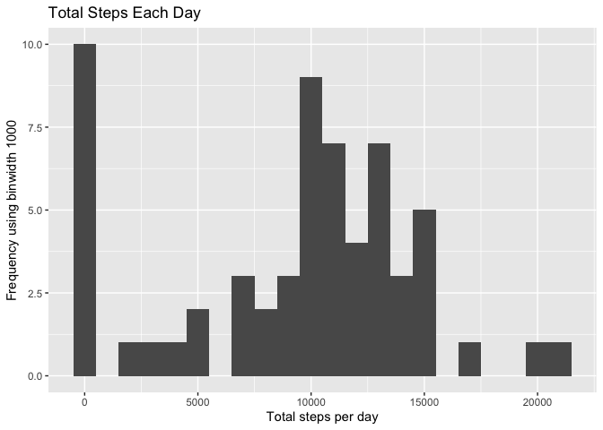
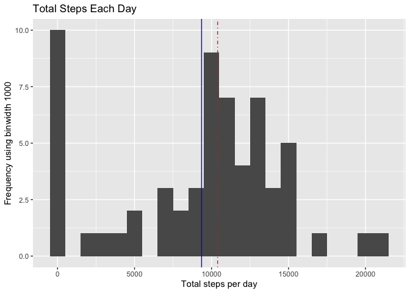
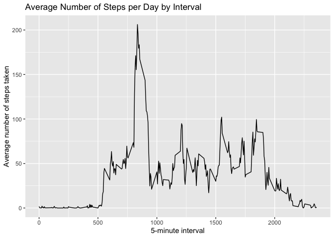
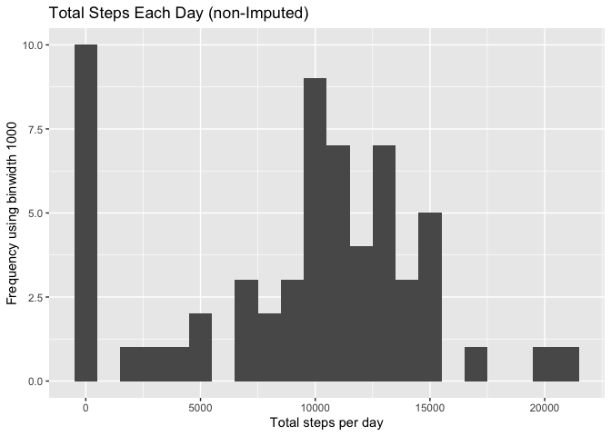
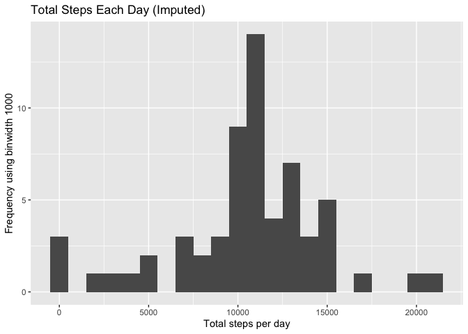
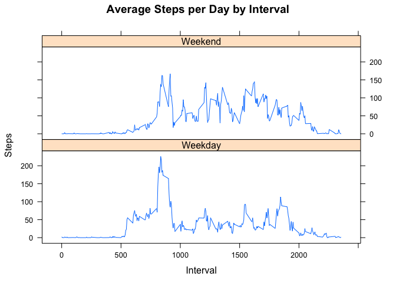

Week 2 - Course Project 1
-------------------------

Peer-Graded Assignment
----------------------

### 1. Code for reading in the dataset and/or processing the data

-   Unzip and read the dataset

<!-- -->

    if(!file.exists('activity.csv')){
        unzip('activity.zip')
    }
    activity <- read.csv('activity.csv')
    activity$date<-as.Date(as.character(activity$date))

### 2. Histogram of the total number of steps taken each day

-   Plot the histogram

<!-- -->

    library(ggplot2)
    stepActivity <- tapply(activity$steps, activity$date, sum, na.rm=TRUE)

    g <- qplot(stepActivity, xlab = 'Total steps per day', ylab = 'Frequency using binwidth 1000', main= 'Total Steps Each Day', binwidth=1000)
    plot(g)

### 3. Mean and median number of steps taken each day

    meanStep <- mean(stepActivity)
    medianStep <- median(stepActivity)

    g <- g + geom_vline(color= 'blue', xintercept = meanStep) +
      geom_vline(color= 'red', linetype = "dotdash", xintercept = medianStep) +
      ggtitle("Total Steps Each Day")
    plot(g)

-   Mean: 9354.23
-   Median: 10395

### 4. Time series plot of the average number of steps taken

    avg_steps_taken <- aggregate(steps ~ interval, activity, mean)

    g <- ggplot(data=avg_steps_taken, aes(x=interval, y=steps)) +
      geom_line() + xlab("5-minute interval") +
      ylab("Average number of steps taken") +
      ggtitle("Average Number of Steps per Day by Interval")
    plot(g)

### 5. The 5-minute interval that, on average, contains the maximum number of steps

-   Maximum number of steps is at: 835

### 6. Code to describe and show a strategy for imputing missing data

    missing<-is.na(activity$steps)

-   The total number of missing values in the dataset is: 2304

### 7. Histogram of the total number of steps taken each day after missing values are imputed

-   Impute missing step by instering the average for that interval
-   2012-10-01 is the first day and all values are missing, following
    day has only 126 step. Hence zero to be replaced for 2012-10-01

<!-- -->

    activityImputed <- transform(activity, steps = ifelse(is.na(activity$steps), avg_steps_taken$steps[match(activity$interval, avg_steps_taken$interval)], activity$steps))
    activityImputed[as.character(activityImputed$date) == "2012-10-01",1 ] <- 0

    stepActivityImputed <- tapply(activityImputed$steps, activityImputed$date, sum)

    qplot(stepActivity, xlab = 'Total steps per day', ylab = 'Frequency using binwidth 1000', main= 'Total Steps Each Day (non-Imputed)', binwidth=1000)

    qplot(stepActivityImputed, xlab = 'Total steps per day', ylab = 'Frequency using binwidth 1000', main= 'Total Steps Each Day (Imputed)', binwidth=1000)

### 8. Panel plot comparing the average number of steps taken per 5-minute interval across weekdays and weekends

    weekdays <- c("Monday", "Tuesday", "Wednesday", "Thursday", "Friday")
    activityImputed$dow <- as.factor(ifelse(is.element(weekdays(as.Date(activityImputed$date)),weekdays), "Weekday", "Weekend"))
    avg_steps_taken_imputed <- aggregate(steps ~ interval + dow, activityImputed, mean)

    library(lattice)
    xyplot(avg_steps_taken_imputed$steps ~ avg_steps_taken_imputed$interval|avg_steps_taken_imputed$dow, main="Average Steps per Day by Interval",xlab="Interval", ylab="Steps",layout=c(1,2), type="l")

### 9. All of the R code needed to reproduce the results (numbers, plots, etc.) in the report

-   Generated and sumbitted !
